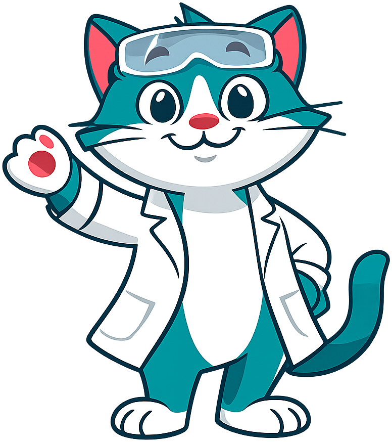
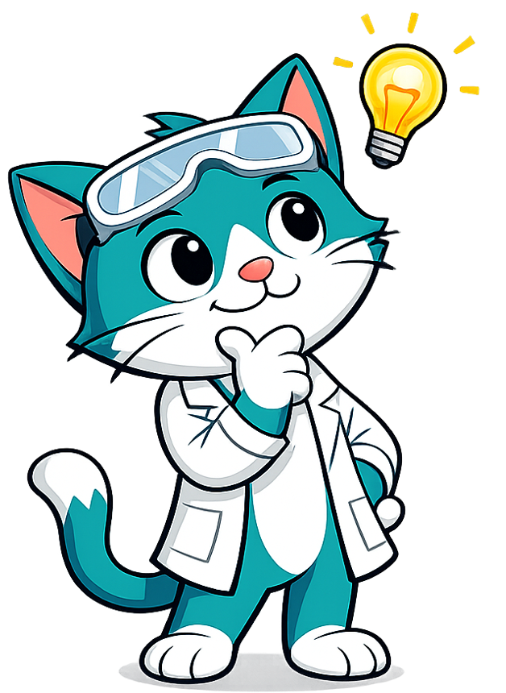
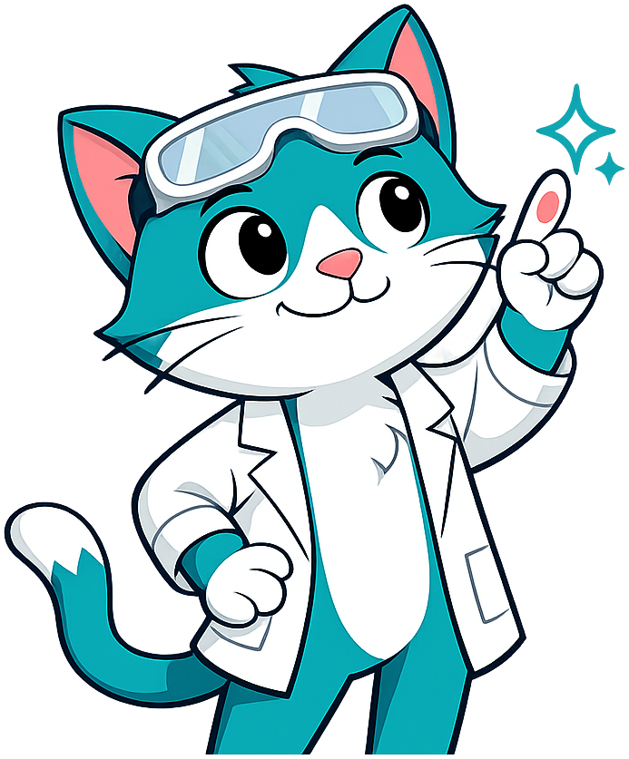
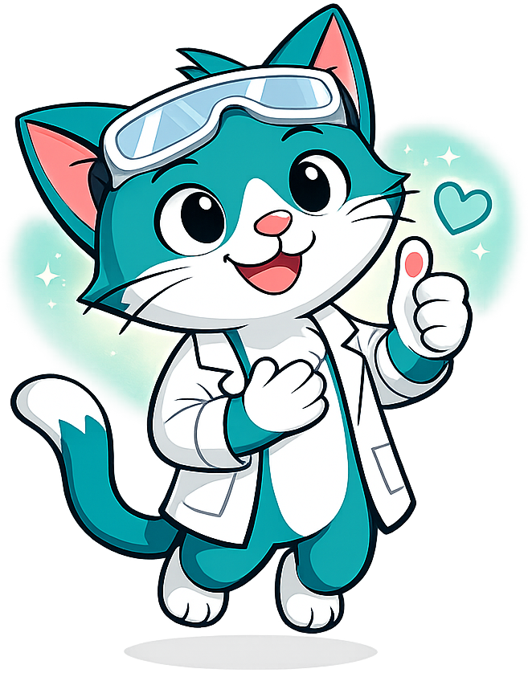
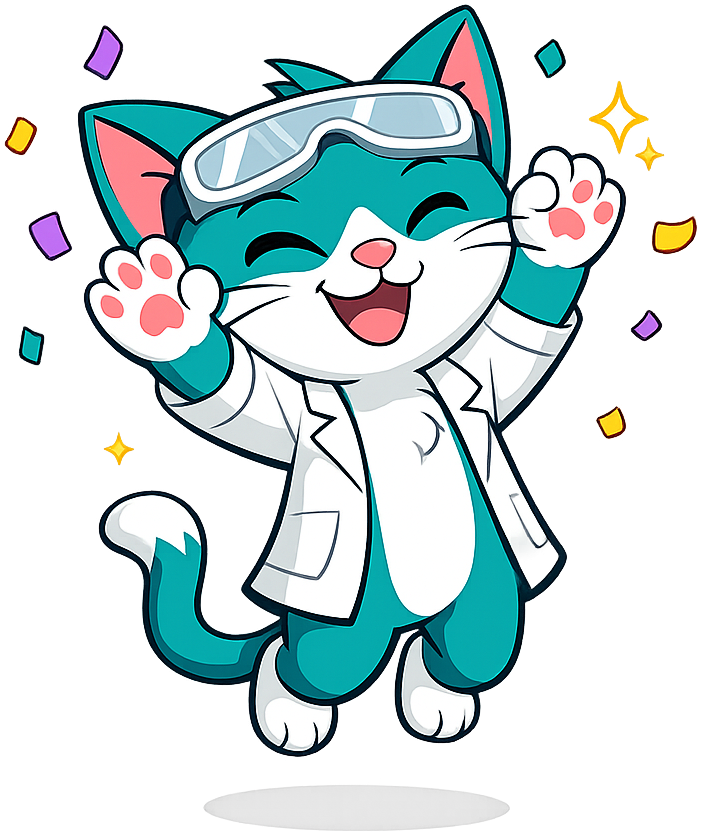
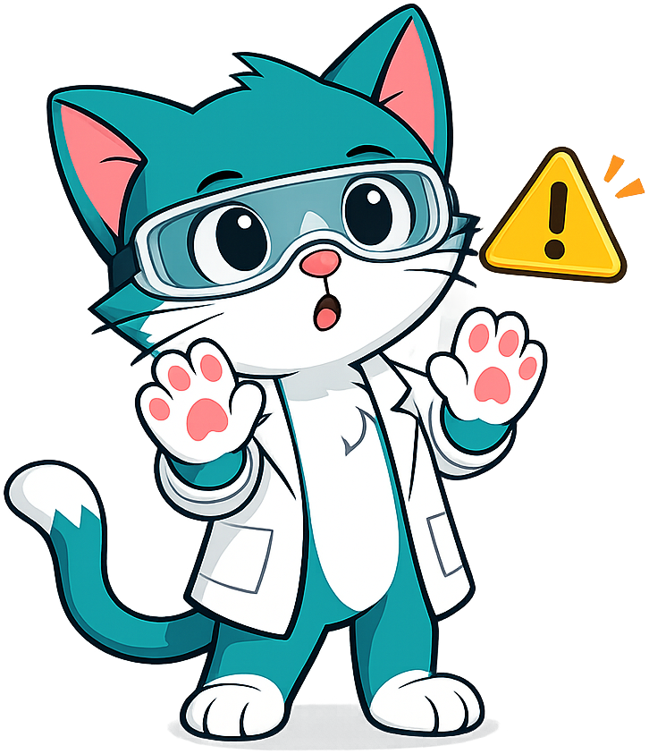
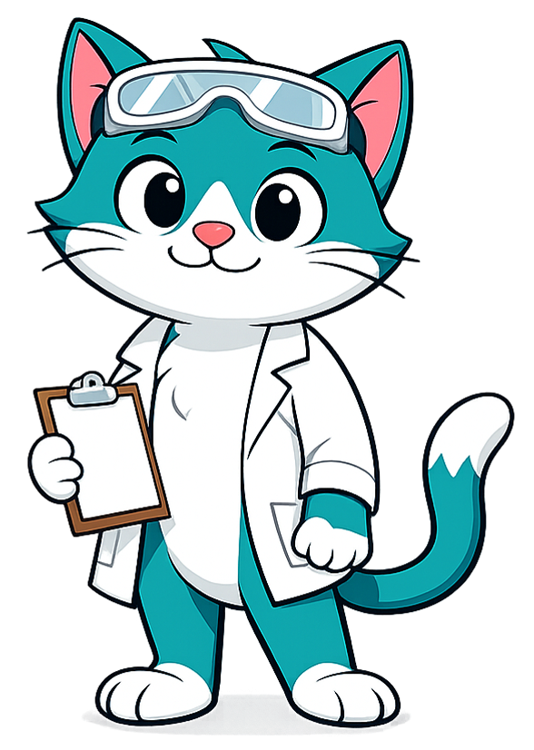

# Catalyst the Cat - Mascot Style Guide

This page shows all mascot images as well as the admonition styles for reference.  Check that all the images have a transparent background
and do not have excessive padding around the drawing.

## Image Tests

1. Welcome
{ width="150px"}
2. Thinking
{ width="150px"}
3. Tip
{ width="150px"}
4. Warning
{ width="150px"}
5. Encouraging
{ width="150px"}
6. Celebration
{ width="150px"}
7. Note (Neutral)
{ width="150px"}

## Admonition Tests

!!! mascot-welcome "Catalyst Says: Let's React!"
    
    Welcome, chemists! I'm Catalyst the Cat, your guide through
    the fascinating world of AP Chemistry. Let's get started!

!!! mascot-thinking "Key Insight (Thinking)"
    
    Notice that every chemical reaction must conserve both mass
    and charge. This is one of the most fundamental principles
    in all of chemistry!

!!! mascot-tip "Catalyst's Tip"
    
    Always balance your equations by starting with the most
    complex molecule first. It saves time and reduces errors!

!!! mascot-warning "Common Mistake"
    
    Don't forget to include state symbols (s), (l), (g), (aq)
    in your equations. The AP exam will expect them!

!!! mascot-encourage "You Can Do This!"
    
    Thermodynamics can feel overwhelming at first. That's
    completely normal! Take it one concept at a time, and
    soon it will all click into place.

!!! mascot-celebration "Great Chemistry!"
    
    You've mastered balancing redox equations! That's one of
    the trickiest skills in AP Chemistry, and you nailed it.

!!! mascot-note "Catalyst's Note"
    
    This concept connects back to what we learned about atomic
    structure in Chapter 1. Electronegativity trends follow
    directly from effective nuclear charge.