# The Table Dreamer: Dmitri Mendeleev and the Shape of Elements

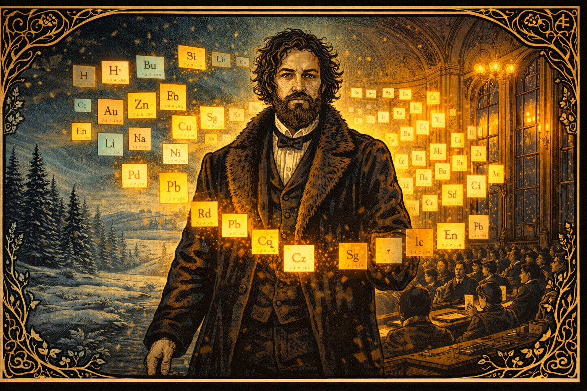

Cover Image Prompt

Cover Image
Please generate a new image.
Image Format:
Create a wide-landscape 16:9 width:height ratio frame.

Drawing Style:
Use graphic-novel drawing using Art Nouveau linework.

The image shows Dmitri Mendeleev — a tall, bearded Russian man in his 40s with wild grey-streaked hair and an intense, piercing gaze — standing before a glowing periodic table rendered as floating luminous index cards arranged in a precise grid. He wears a long dark academic coat trimmed with fur. Behind him, a snowy Siberian landscape of dense pine forests and frozen steppes transitions left-to-right into the ornate interior of a 19th-century St. Petersburg lecture hall with tall arched windows and gas-lamp chandeliers. The periodic table cards glow amber and teal, casting warm light on his face from below. Decorative Art Nouveau borders of intertwining botanical and chemical element symbol motifs frame the entire image. Dramatic directional uplighting emphasizes his determination and authority. Color palette: deep teal, amber gold, ivory snow, charcoal grey.

    
Narrative Prompt

Create a historically grounded yet dramatic graphic novel narration about Dmitri Mendeleev (1834-1907). Tone: determined, curious, occasionally wry. Highlight obstacles: remote Siberian upbringing, poverty, illness, resistance from colleagues, political backlash. Use sensory details from 19th-century Russia (snow, ink, gas lamps). Show key breakthroughs: Karlsruhe Congress, arranging cards, predicting missing elements, defending science under tsarist scrutiny. Style: cinematic, alternating close-up dialogue and wide landscape panels.

### Prologue – Snowflakes and Empty Pockets

Tobolsk, Siberia, 1847. Dmitri hugs a satchel stitched by his mother as the winter train rattles toward St. Petersburg. “Find the hidden order,” she whispers through the wind, gifting him a handmade card of copper symbols. The boy presses his palm to the cold glass, vowing to discover the grammar beneath the chaos of matter—even if everyone else thinks a penniless Siberian cannot.

Image Prompt

Please generate a new image.
Image Format:
Create a wide-landscape 16:9 width:height ratio frame.

Drawing Style:
Use graphic-novel drawing using Art Nouveau linework.

The image shows the interior of a 19th-century Russian train car in deep winter. Teenage Dmitri Mendeleev, approximately 13 years old, sits pressed against a frost-crusted window. He wears a threadbare brown wool coat two sizes too big, with a rough hand-knit scarf knotted at his neck. He holds a small copper-etched card in his mittened hands, staring at it with intense concentration. Outside the window, a blizzard of white snow obscures a dark pine forest and flat Siberian steppe. Other passengers are bundled in heavy furs and dozing. A single oil lamp swings overhead, casting a warm amber pool on Dmitri's pale, angular face. His hand-stitched satchel rests at his feet. Swirling Art Nouveau linework echoes the snow patterns outside and frames the window edges. Color palette: muted silver-blue ice tones, warm amber lamp glow, ivory snow. Mood: hopeful yet anxious.

## Chapter 1 – The Snowbound Apprentice

The journey nearly fails before it begins. Timbers crack, wolves howl, and Dmitri spends nights tutoring fellow passengers just to pay for bread. Between lessons he sketches laboratory glassware he has only seen in books. Each new friend signs his card like a passport, proof that knowledge can cross the Urals even when money cannot.

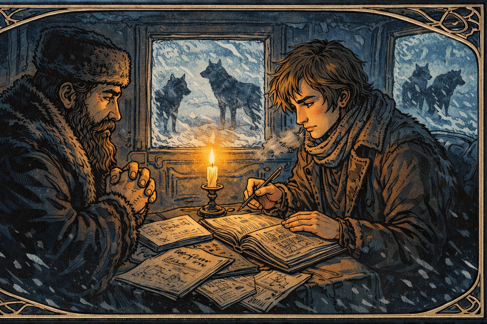

Image Prompt

Please generate a new image.
Image Format:
Create a wide-landscape 16:9 width:height ratio frame.

Drawing Style:
Use graphic-novel drawing using Art Nouveau linework.

The image shows the dimly lit interior of a 19th-century Russian stagecoach at night. Young Dmitri Mendeleev, lanky and earnest, leans across a narrow wooden bench tutoring a stout fur-clad merchant by the light of a single tallow candle in a tin holder. The merchant squints at a handwritten page Dmitri holds toward him. Open sketchbooks spread across the bench and floor are filled with meticulous drawings of laboratory glassware — flasks, condensers, retorts — rendered with obsessive precision. Through the icy frosted windows, two large grey wolves are silhouetted clearly against a moonlit snowfield outside. The candle provides the only warm amber glow against deep indigo shadow. Art Nouveau border scrollwork incorporates the wolf silhouettes and bare winter branch motifs. Color palette: warm candle amber, deep indigo shadow interior, cold icy-blue exterior light through windows.

## Chapter 2 – St. Petersburg or Bust

Arrival feels like a collision—ornate palaces, professors who barely glance at the lanky new student, and a university that almost refuses him because of limited seats. Dmitri pleads with his mother’s standing, and the dean relents: “You may stay if you stand at the back.” He smiles. From the back row, one can see the whole board.

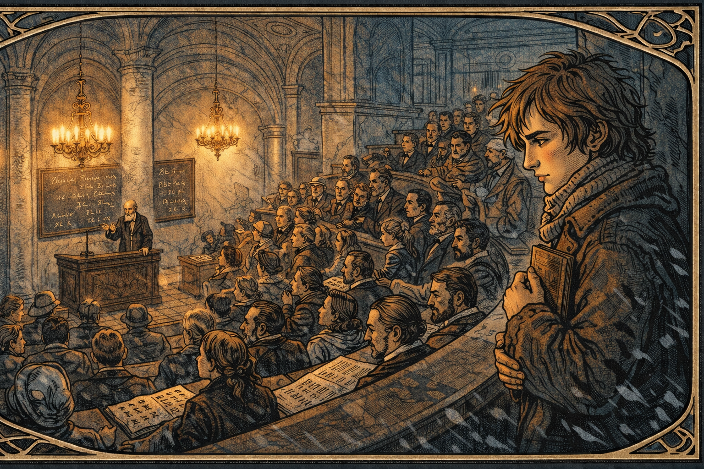

Image Prompt

Please generate a new image.
Image Format:
Create a wide-landscape 16:9 width:height ratio frame.

Drawing Style:
Use graphic-novel drawing using Art Nouveau linework.

The image shows a grand 1860s St. Petersburg university lecture hall. Tall arched windows with frosted glass line the side walls; elaborate crystal chandeliers hang from an ornate plaster ceiling with classical relief decoration. Rows of curved dark-wood benches are packed with well-dressed male students in formal coats. At the far front, a stern grey-haired dean in academic robes stands at a raised lectern, arms crossed, glaring toward the back of the room. In the far rear of the hall, young Dmitri Mendeleev stands upright and alone against the back wall, holding a stack of notebooks to his chest with both arms. Despite being forced to stand, his posture is confident and almost satisfied — from here he can see the entire blackboard clearly over every head. The room contrasts cold pale-grey marble architecture with warm amber lamplight. Expressive faces in the audience range from dismissive smirks to curious glances back. Art Nouveau carved detail decorates the balcony railing and window tracery. Color palette: cool stone grey and pale blue marble, warm amber and gold lamp glow.

## Chapter 3 – Ink, Fire, and Tuberculosis

Working in a glass factory to fund studies, Dmitri inhales vapors and contracts tuberculosis. Doctors order Siberian exiled. Instead, he writes. Wrapped in blankets, he drafts a chemistry textbook, coughing crimson onto the margins. “If my lungs fail, at least my notes will breathe,” he mutters, turning sickness into syllabus.

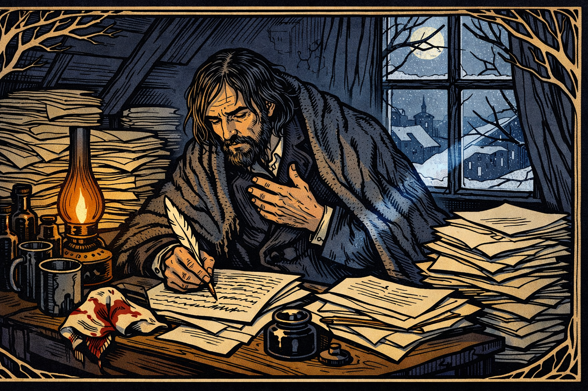

Image Prompt

Please generate a new image.
Image Format:
Create a wide-landscape 16:9 width:height ratio frame.

Drawing Style:
Use graphic-novel drawing using Art Nouveau linework.

The image shows a cramped, cold attic room in St. Petersburg in deep winter. Dmitri Mendeleev, now in his late 20s with sunken cheeks showing illness, sits hunched at a small writing desk buried under stacked manuscript pages. He wears a heavy overcoat pulled over his nightclothes with an ink-stained woolen blanket draped over his shoulders for warmth. A bloodstained handkerchief lies crumpled beside his inkwell. He grips a quill pen, caught mid-sentence — one hand pressed to his chest mid-cough, the other still pressing the pen to the page. Several dark medicine bottles and a tin cup of cold tea crowd one corner of the desk. A cracked single window admits cold moonlight as a blue-white shaft across the manuscript pages. A nearly-spent gas lamp provides warm amber glow from the other side. Art Nouveau bare winter branch motifs are woven into the window frame design. Color palette: deep indigo shadow, ivory manuscript pages, amber lamp glow, crimson accent. Mood: grim, exhausted determination.

## Chapter 4 – Academy Without Apparatus

The St. Petersburg Academy hires him—but there is barely any equipment. Dmitri fashions makeshift apparatus from samovars and wine bottles, inviting students to improvise. “If we cannot buy a balance, we will become one,” he jokes. Laughter returns to the lab, and data begins to flow despite the austerity.

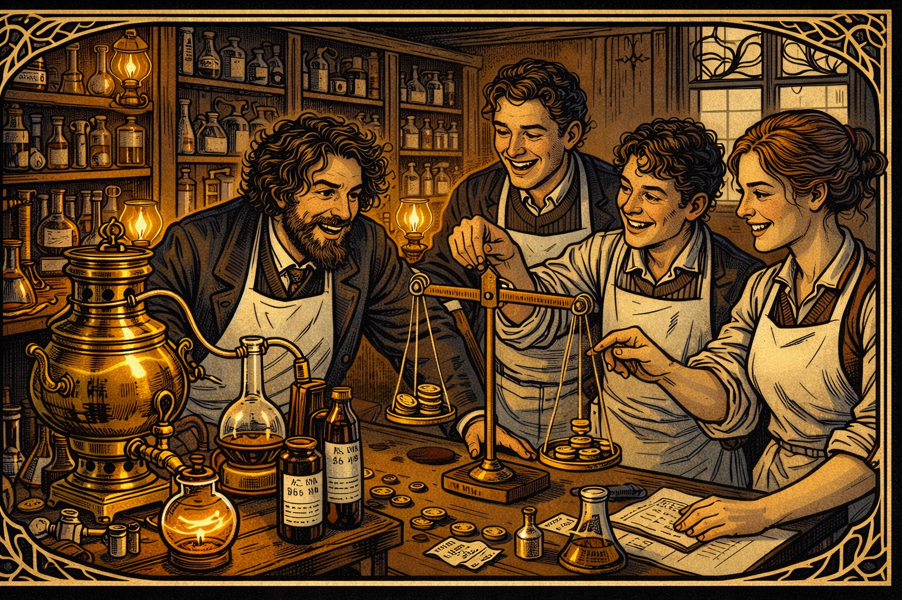

Image Prompt

Please generate a new image.
Image Format:
Create a wide-landscape 16:9 width:height ratio frame.

Drawing Style:
Use graphic-novel drawing using Art Nouveau linework.

The image shows a repurposed university workshop functioning as an improvised chemistry laboratory. Dmitri Mendeleev, now a young professor in his early 30s with wild curly hair and an enthusiastic grin, leans over a central workbench where a polished brass samovar has been fitted with rubber tubing to serve as a distillation apparatus. Wine bottles marked with hand-drawn ink graduations serve as beakers. Three students — two young men and one young woman — laugh together as they carefully adjust a balance made from a wooden ruler suspended on string with coins as weights. Shelves along the back wall hold a chaotic but organized mix of official chemistry glassware alongside the improvised substitutes. Gas lamps cast warm golden light on polished brass surfaces. Art Nouveau decorative elements appear in the carved wooden shelving brackets and window ironwork. Color palette: warm brass amber, deep mahogany wood, white laboratory linen aprons. Mood: lively, inventive, and collegial.

## Chapter 5 – Colors of Siberia

His first major manuscript, *Organic Chemistry*, wins the Demidov Prize. During the award ceremony Dmitri feels the floor tilt; he sees not colors of dyes but colors of Siberia, a palette of possibility. He spends the prize on traveling libraries for rural schools—reminding officials that science is not just for salons.

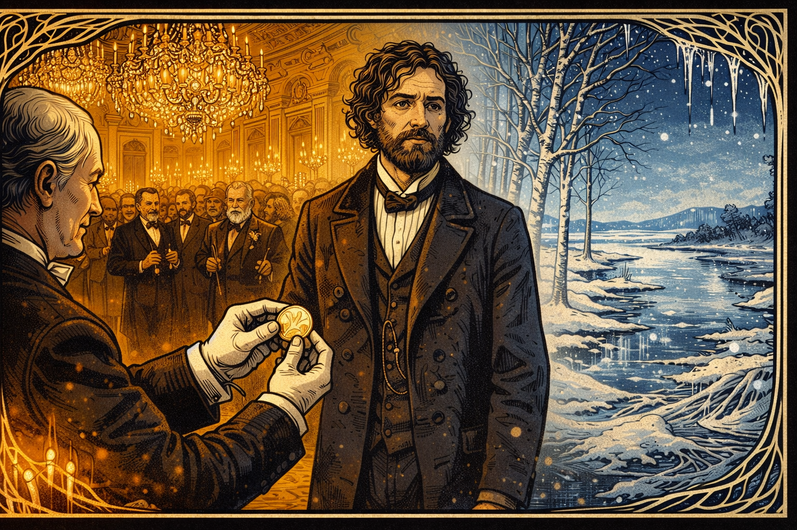

Image Prompt

Please generate a new image.
Image Format:
Create a wide-landscape 16:9 width:height ratio frame.

Drawing Style:
Use graphic-novel drawing using Art Nouveau linework.

The image shows an opulent St. Petersburg ballroom during the 1861 Demidov Prize ceremony. Crystal chandeliers blaze with candlelight above. Formally dressed dignitaries and academics fill the gilded room. At center stage, Dmitri Mendeleev in an ill-fitting formal coat receives a gold Demidov Medal from a white-gloved official — but Mendeleev's gaze is unfocused, looking past the ceremony into the middle distance. In a dreamlike double-exposure occupying the right half of the image, a vision of the Siberian steppe materializes: silver birch trees, a frozen river, a vast cobalt sky. The two scenes blend seamlessly with Art Nouveau swirling linework — chandelier crystal droplets morphing into icicles, the ballroom's parquet floor dissolving into frozen ground. Left side warm gold; right side cold silver-blue. Mendeleev stands at the threshold between both worlds. Mood: conflicted triumph and deep nostalgia.

## Chapter 6 – Cards on the Wallpaper

Preparing a new general chemistry text, Dmitri scribbles element data on index cards and pins them to floral wallpaper. The cards refuse to align. He rearranges them overnight, eyelids gritty. To stay awake he plays piano scales with one hand while moving cards with the other, turning his study into a musical lab.

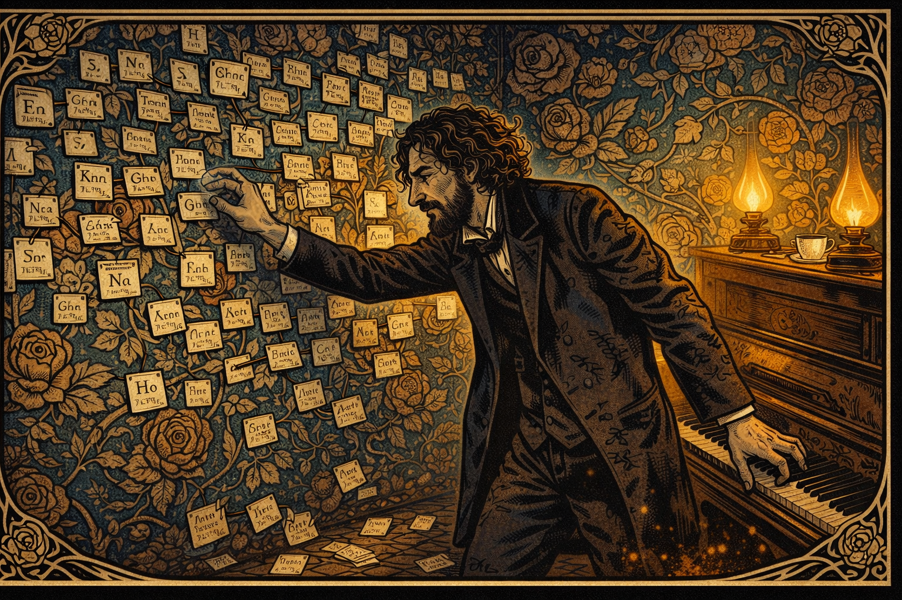

Image Prompt

Panel 7
Please generate a new image.
Image Format:
Create a wide-landscape 16:9 width:height ratio frame.

Drawing Style:
Use graphic-novel drawing using Art Nouveau linework.

The image shows Dmitri Mendeleev's private study late at night. The walls are completely covered in bold Victorian floral wallpaper — large roses and twisting vine patterns — upon which hundreds of small white index cards have been pinned with colored straight pins. Each card bears a handwritten element name, chemical symbol, and atomic weight in small precise script. Mendeleev, now in his mid-30s with increasingly wild hair and ink-stained fingers, stands in the center with one arm reaching toward the wallpaper to reposition a card, while his other arm reaches backward to strike keys on an upright wooden piano. His face shows half-mad concentration and exhaustion. Several cards have fallen from the wall to the floor around his feet. Two guttering gas lamps cast warm amber pools of light against deep shadow. A cold cup of tea sits untouched on the piano lid. Art Nouveau botanical motifs in the wallpaper incorporate element symbol lettering into the vine and rose designs. Color palette: rich sepia and brown, deep teal wallpaper, warm amber lamplight, ivory card stock. Mood: brilliant obsession at the edge of breakthrough.

## Chapter 7 – Dream of the Table

Exhausted, he collapses at his desk and dreams the cards fall into neat staircases. Waking with a gasp, he sketches the periodic table in minutes. “In this pattern, elements with similar souls stand together,” he writes, leaving blank spaces labeled “eka-boron,” “eka-aluminum,” daring future chemists to find them.

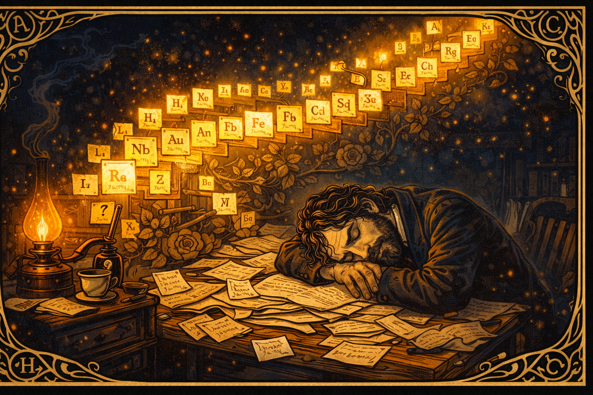

Image Prompt

Panel 8
Please generate a new image.
Image Format:
Create a wide-landscape 16:9 width:height ratio frame.

Drawing Style:
Use graphic-novel drawing using Art Nouveau linework.

The image shows Dmitri Mendeleev slumped at his writing desk, asleep, head resting on his folded arms atop a chaos of scattered manuscript pages. His face is peaceful — the tension of days of struggle finally released. Above him, rising from the paper chaos, spectral glowing index cards float upward and arrange themselves into illuminated ascending staircases — the periodic table forming in dreamspace. Each card glows with its element symbol in amber and gold light against the dark room. Several cards near the edges are blank with question marks, representing elements not yet discovered. The dream-cards cast warm light onto Mendeleev's sleeping face from above. The room is otherwise in deep shadow except for a single dying gas lamp at left. Art Nouveau swirling linework forms the dreamspace border, with elemental symbols woven into the decorative flourishes. Color palette: deep shadow navy, warm amber dream-light, glowing gold card edges, ivory paper. Mood: peaceful revelation after long struggle.

## Chapter 8 – The Congress of Doubt

At the Karlsruhe Congress, he presents the periodic idea to wary European chemists. “Your table is a tapestry of coincidences,” sneers one. Dmitri calmly folds the table into a paper plane emblazoned with gaps. “Coincidences predict nothing. Watch these gaps fill.” He launches the plane across the hall—symbolic bravado that students later repeat as legend.

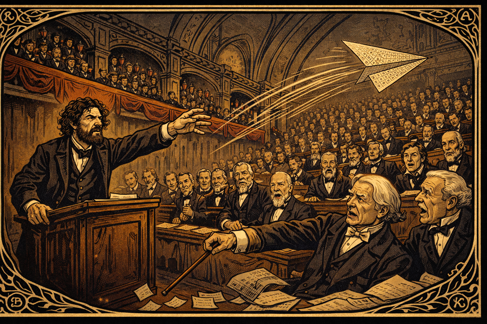

Image Prompt

Panel 9
Please generate a new image.
Image Format:
Create a wide-landscape 16:9 width:height ratio frame.

Drawing Style:
Use graphic-novel drawing using Art Nouveau linework.

The image shows a formal European scientific congress hall in the 1860s — high vaulted ceilings with dark wood paneling, red-draped gallery balconies, rows of seated scientists in frock coats and formal academic attire. At the front lectern, Dmitri Mendeleev with wild hair and fierce eyes has just launched a paper airplane across the hall. The airplane — folded from a large printed sheet bearing the periodic table grid with visible blank squares — arcs dramatically through the air above the heads of the seated scientists. Dynamic motion lines show its trajectory. In the foreground, a pompous white-haired German chemist gestures dismissively with his walking cane. Other scientists show open-mouthed shock, indignant disapproval, or barely suppressed grins. Art Nouveau decorative borders along the architectural trim incorporate element symbols. Color palette: muted formal browns and dark wood, crimson academic sashes and drapes, ivory paper airplane with bold black grid. Mood: playful intellectual defiance and absolute confidence.

## Chapter 9 – Gallium Knocks

Years later gallium is discovered with the exact density and melting point he predicted for eka-aluminum. Dmitri receives the telegram while repairing a leaking roof. He laughs, rain soaking his beard, and holds the paper to the sky: “Welcome, little metal! Tell them there are more of you coming.” Skeptics fall silent.

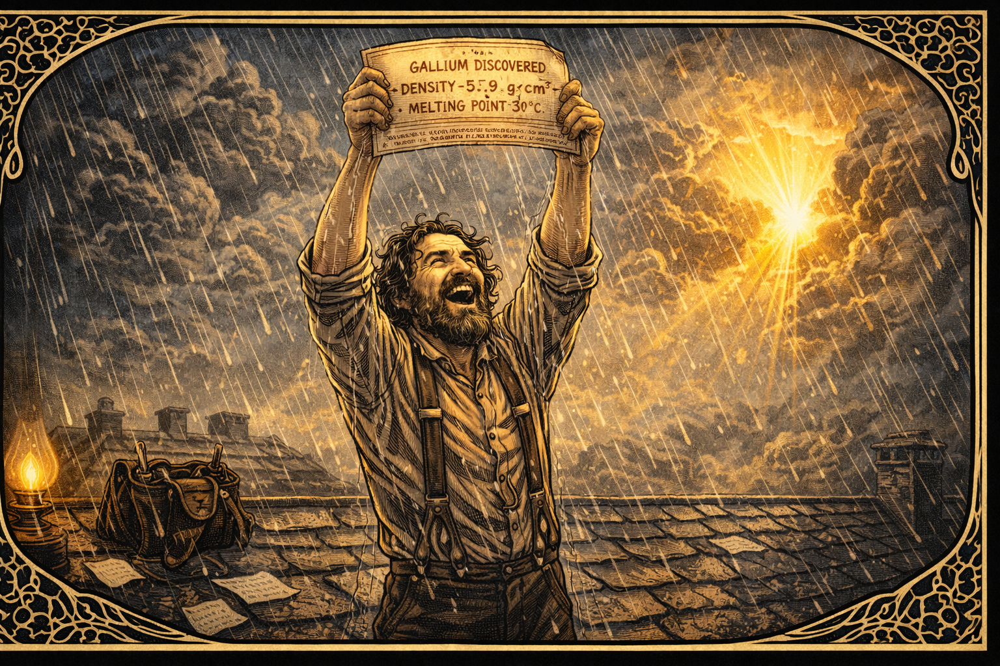

Image Prompt

panel 10
Please generate a new image.
Image Format:
Create a wide-landscape 16:9 width:height ratio frame.

Drawing Style:
Use graphic-novel drawing using Art Nouveau linework.

The image shows Dmitri Mendeleev, now middle-aged with a full beard beginning to grey at the edges, standing on a wet slate rooftop in driving rain. He wears work clothes — suspenders over a linen shirt, sleeves rolled to the elbows — indicating he was in the middle of roof repairs when the telegram arrived. A leather tool bag sits behind him on the roof. He holds the telegram high above his head with both hands, face tilted upward, laughing with unselfconscious joy, rain streaming down his beard and through his wild hair. The telegram text reads clearly: "GALLIUM DISCOVERED — DENSITY 5.9 g/cm³ — MELTING POINT 30°C" — matching his predictions precisely. Behind him, dramatic storm clouds part to reveal a shaft of warm golden sunlight breaking through. Art Nouveau border motifs incorporate stylized gallium crystal lattice structures and rain droplet patterns. Color palette: silver-grey rain, dark wet slate roof, golden sunburst breakthrough, drenched dark clothing. Mood: pure vindicated joy.

## Chapter 10 – Science vs. Bureaucracy

The tsar asks Dmitri to head the Bureau of Weights and Measures and to approve inferior vodka for taxation. Dmitri refuses, publishing a scathing report about standards. Punished, he is forced to resign from the academy. “You cannot exile relationships between elements,” he tells friends, sharpening his fountain pen.

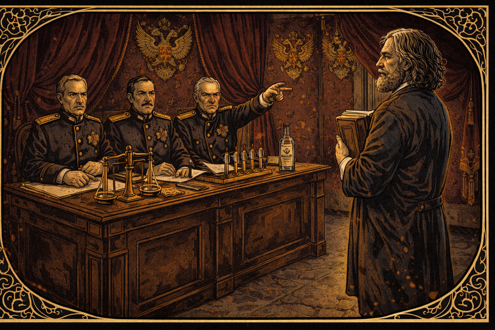

Image Prompt

Panel 11
Please generate a new image.
Image Format:
Create a wide-landscape 16:9 width:height ratio frame.

Drawing Style:
Use graphic-novel drawing using Art Nouveau linework.

The image shows an imposing imperial Russian government office. Heavy burgundy velvet drapes hang floor-to-ceiling; gold imperial double-eagle motifs decorate the walls. Three stern bureaucrats in dark dress uniforms with gold epaulettes sit behind a massive mahogany desk, their expressions cold and dismissive. One points toward the door with a rigid arm. Before them stands Mendeleev, now in his 50s with flowing white-streaked hair and a full beard, clutching a thick bound scientific report to his chest with both hands. His posture is unbowed, meeting their gaze directly and without flinching. On the desk between them sit precision measurement scales, a row of glass hydrometers, and a sealed official bottle of vodka representing the compromised standards he refuses to endorse. Art Nouveau ironwork frames the scene in bitter ornamental irony — beautiful but cold. Color palette: deep burgundy velvet, imperial gold hardware, cool grey stone floor, warm olive skin tones for Mendeleev against ashen bureaucratic faces. Mood: principled defiance against institutional power.

## Chapter 11 – Aviation and Whale Oil

Never idle, he designs smokeless powders, aerostat envelopes, and even studies whale oil composition to support polar expeditions. Students call him “the chemist who won’t sit down.” In workshops smelling of varnish and steam, Dmitri teaches that science is a toolkit for every societal challenge.

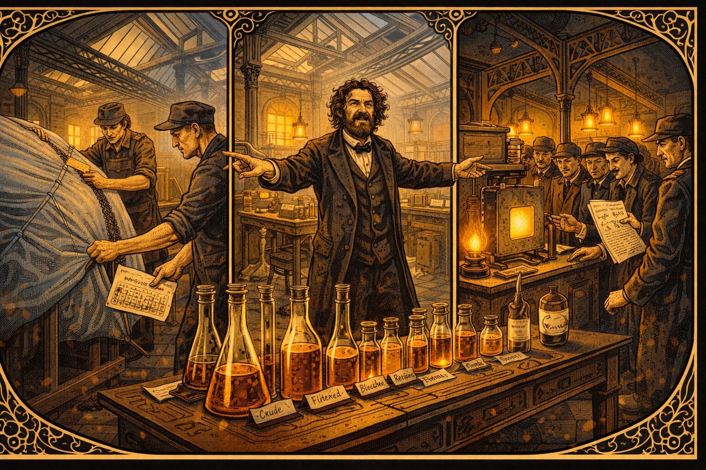

Image Prompt

Panel 12
Please generate a new image.
Image Format:
Create a wide-landscape 16:9 width:height ratio frame.

Drawing Style:
Use graphic-novel drawing using Art Nouveau linework.

The image is a three-panel montage composition within a single 16:9 frame, showing three simultaneous projects in a large 1880s industrial workshop with high iron-girder ceilings and skylights. Left third: workers stretch pale silvery-blue aerostat envelope fabric over a wooden form while Mendeleev points at a seam holding a technical diagram. Center third: a long laboratory bench holds rows of glassware containing amber whale oil samples at different analytical stages; handwritten labels identify each sample. Right third: engineers crowd a bench-top testing chamber for smokeless powder, one holding Mendeleev's handwritten chemical formula. Mendeleev himself stands at the intersection of all three scenes, both arms outstretched gesturing to different groups simultaneously, his wild hair and beard making him unmistakable. Cast-iron structural columns with Art Nouveau decorative detail anchor the composition. Industrial skylights admit cool grey daylight mixed with warm gas-lamp amber. Color palette: warm brass and amber, navy and grey fabric, ivory paper formulas. Mood: restless multi-directional genius.

## Chapter 12 – Legacy of Gaps

In his final lectures he lays a blank card on each student’s desk. “Someday you will write the name of an element or idea that does not yet exist.” As snow falls outside, Dmitri’s beard gleams white, but his eyes sparkle cobalt. He has shown that absence itself can be evidence, that patience can be predictive.

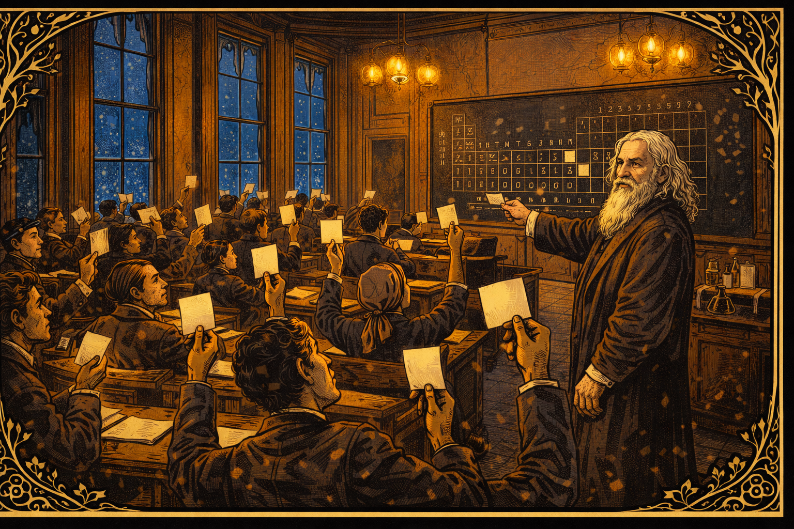

Image Prompt

Panel 13
Please generate a new image.
Image Format:
Create a wide-landscape 16:9 width:height ratio frame.

Drawing Style:
Use graphic-novel drawing using Art Nouveau linework.

The image shows a university lecture hall at twilight. Tall narrow windows line the side walls; through them, large snowflakes fall slowly against a deepening cobalt-blue winter sky. The warm interior glows golden from gas chandeliers overhead. Students — young men and women of varied backgrounds — sit at wooden writing desks, each holding up a small blank white index card, examining it with thoughtful or wondering expressions. Some have already begun writing the first letters of a word. At the front of the hall, elderly Dmitri Mendeleev — now in his 70s with a magnificent white beard and long silver hair, wearing a worn dark academic gown — stands before a large blackboard bearing the periodic table. Several squares in the table remain blank, deliberately. He watches the students with a gentle half-smile, his cobalt-blue eyes still sharp and alive. Art Nouveau botanical motifs intertwine bare winter branches with budding spring leaves in the window frame borders — endings and beginnings together. Color palette: warm interior gold and amber, cool cobalt exterior, ivory blank card white. Mood: hopeful completion, legacy passed forward to the next generation.

### Epilogue – What Made Mendeleev Different?

| Challenge | How Mendeleev Responded | Lesson for Today |
|-----------|-------------------------|------------------|
| Remote, impoverished upbringing in Siberia | Tutored others for travel money, self-studied from sparse books, treated every hardship as data | Limited resources can sharpen creativity if curiosity stays loud |
| Academic skepticism toward the periodic table | Predicted new elements with specific properties, welcomed falsification, let evidence do the arguing | Bold hypotheses matter when paired with testable predictions |
| Political pressure to compromise standards | Resigned posts rather than endorse bad science, published transparent findings, kept focus on public good | Integrity sustains science longer than titles |

### Call to Action

Grab a stack of index cards. Write today’s building blocks—atoms, ideas, or questions—on each one. Shuffle them until patterns emerge. When the gaps appear, don’t fear them; label them. Someone will discover what fits, and it might be you.

---

*"Leave room for the unknown; no discovery was ever made where everything was already explained."*  
—Dmitri Mendeleev

*"Science begins with measurement; without it, we wander in a fog."*  
—Dmitri Mendeleev

*"The best scientist is open to experiment, whether the subject is vodka or vanadium."*  
—Attributed to Dmitri Mendeleev

---

## References

1. Michael Gordin, *A Well-Ordered Thing: Dmitrii Mendeleev and the Shadow of the Periodic Table*, Harvard University Press, 2004.
2. William B. Jensen, *The Periodic Table: Its Story and Its Significance*, Oxford University Press, 2006.
3. J. van Spronsen, *The Periodic System of Chemical Elements: A History of the First Hundred Years*, Elsevier, 1969.
4. Primary correspondence of Dmitri Mendeleev archived at the Russian Academy of Sciences (translated selections).
