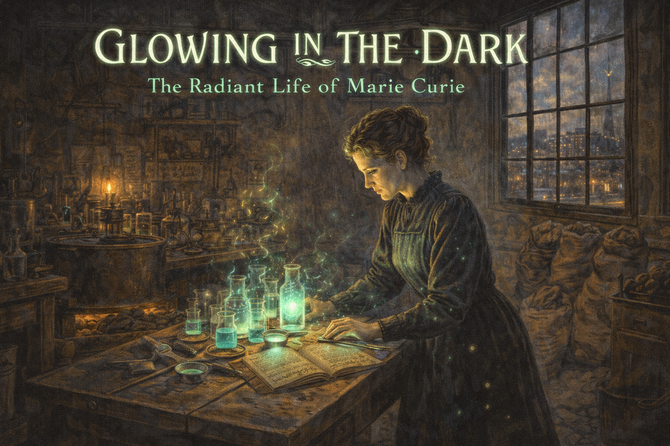

# Chemistry Graphic Novel Stories

Explore narrative-driven lessons about the scientists who shaped chemistry. Each story pairs text with cinematic image prompts so classrooms can discuss both the human drama and the science breakthroughs.

- **[Glowing in the Dark](marie-curie/index.md)**

    
    She couldn't go to university in her home country because she was a woman. So she moved to Paris, nearly starved, and worked in a leaky shed for four years. She discovered two new elements, won two Nobel Prizes, and invented mobile X-ray units that saved thousands of soldiers' lives. The radiation that made her famous also killed her.

- **[The Table Dreamer](dmitri-mendeleev/index.md)**

    
    Dmitri Mendeleev fights through Siberian poverty, illness, and tsarist politics to assemble the periodic law, proving that disciplined imagination can predict unseen elements.

